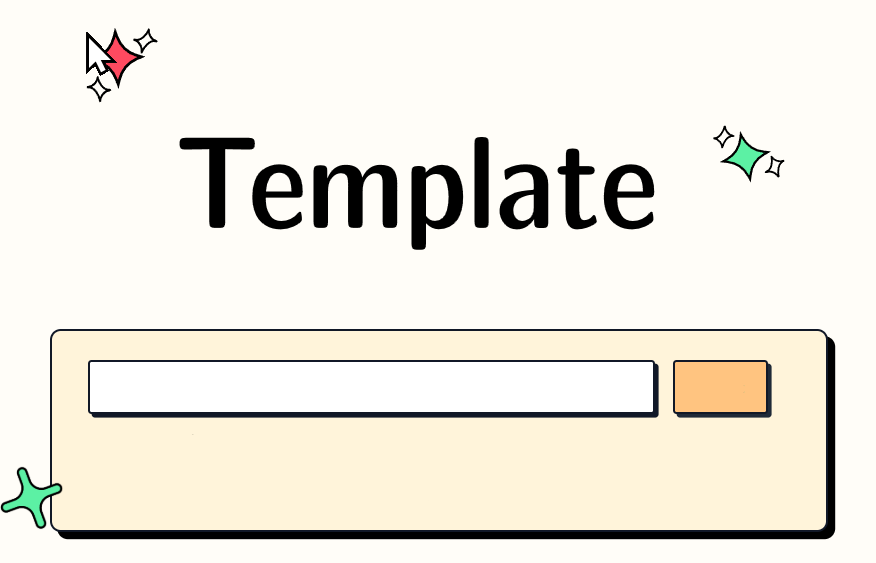

# {{ project_name }}

[]({{ project_url }})

{{ project_badges }}

[]({{ discord_invite }})

{{ project_description }}

{{ project_url }} · [Chrome Extension]({{ chrome_extension_url }}) · [Firefox Add-on]({{ firefox_extension_url }})

## 🚀 Features

{{ project_features }}

## 📦 Installation

``` bash
pip install {{ package_name }}
```

## 🧩 Browser Extension Usage

<!-- markdownlint-disable MD033 -->
<a href="{{ chrome_extension_url }}" target="_blank" title="Get {{ project_name }} Extension from Chrome Web Store"></a>
<a href="{{ firefox_extension_url }}" target="_blank" title="Get {{ project_name }} Extension from Firefox Add-ons"></a>
<a href="{{ edge_extension_url }}" target="_blank" title="Get {{ project_name }} Extension from Edge Add-ons"></a>
<!-- markdownlint-enable MD033 -->

{{ project_extension_informations }}

## 💡 Command line usage

{{ project_command_line_usage }}

## 🐛 Python package usage

{{ project_python_package_usage }}

## 🌐 Self-host

1. Build the image:

   ``` bash
   docker build -t {{ package_name }} .
   ```

2. Run the container:

   ``` bash
   docker run -d --name {{ package_name }} -p 8000:8000 {{ package_name }}
   ```

The application will be available at `http://localhost:8000`.

If you are hosting it on a domain, you can specify the allowed hostnames via env variable `ALLOWED_HOSTS`.

   ```bash
   # Default: "gitingest.com, *.gitingest.com, localhost, 127.0.0.1".
   ALLOWED_HOSTS="example.com, localhost, 127.0.0.1"
   ```

## ✔️ Contributing to {{ project_name }}

### Non-technical ways to contribute

- **Create an Issue**: If you find a bug or have an idea for a new feature, please [create an issue](https://github.com/{{ github_username }}/{{ github_repository }}/issues/new) on GitHub. This will help us track and prioritize your request.
- **Spread the Word**: If you like {{ project_name }}, please share it with your friends, colleagues, and on social media. This will help us grow the community and make {{ project_name }} even better.
- **Use {{ project_name }}**: The best feedback comes from real-world usage! If you encounter any issues or have ideas for improvement, please let us know by [creating an issue](https://github.com/{{ github_username }}/{{ github_repository }}/issues/new) on GitHub or by reaching out to us on [Discord]({{ discord_invite }}).

### Technical ways to contribute

{{ project_name }} aims to be friendly for first time contributors, with a simple python and html codebase. If you need any help while working with the code, reach out to us on [Discord]({{ discord_invite }}). For detailed instructions on how to make a pull request, see [CONTRIBUTING.md](./CONTRIBUTING.md).

## 🛠️ Stack

- [Tailwind CSS](https://tailwindcss.com) - Frontend
- [FastAPI](https://github.com/fastapi/fastapi) - Backend framework
- [Jinja2](https://jinja.palletsprojects.com) - HTML templating
- [apianalytics.dev](https://www.apianalytics.dev) - Simple Analytics

## Project Growth

[](https://star-history.com/#{{ github_username }}/{{ github_repository }}&Date)
